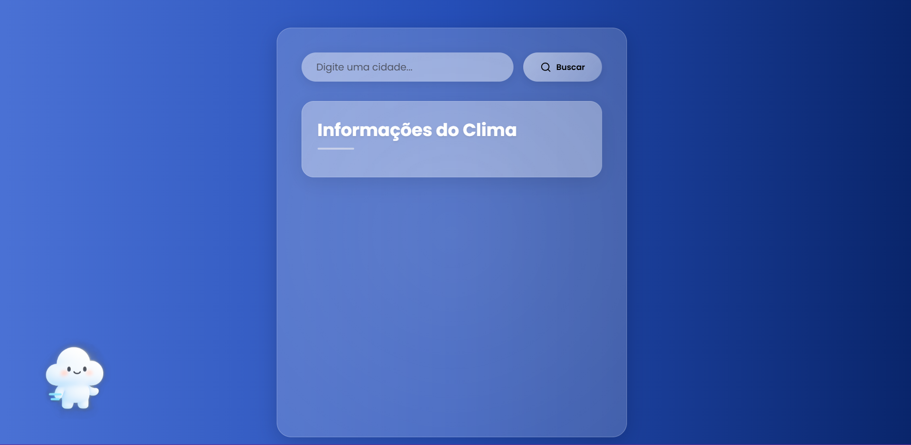

# 🌦️ Sistema de Clima com Mascote Interativo

Este projeto é um sistema de previsão do tempo desenvolvido em React com estilização em **Glassmorphism**, integração com a **WeatherAPI**, e um mascote que **reage ao clima e fala com o usuário**! 🐾🗣️

---

## ✨ Funcionalidades

- 🔍 Busca de cidade com Enter ou botão
- 📅 Previsão para os próximos 3 dias
- 🎨 Estilização dinâmica com fundo e texto que mudam conforme o clima
- 🧸 Mascote que muda de aparência e fala 
- 🗣️ Voz gerada via Web Speech API
- 📦 Componentização com Styled Components

---

## 🧠 Tecnologias e APIs utilizadas

- **React + TypeScript**
- **Styled Components** para estilização
- **WeatherAPI** para dados climáticos ([https://www.weatherapi.com](https://www.weatherapi.com))
- **Web Speech API** para síntese de voz
- **Google Fonts** para tipografia personalizada

---

## 🖼️ Imagens do sistema

### Interface principal


### Mascotes por condição climática

| Ensolarado | Chuvoso | Nublado |
|------------|---------|---------|
|  |  |  |

---

## 🚀 Como rodar o projeto

```bash
# Instale as dependências
npm install

# Inicie o servidor de desenvolvimento
npm run dev

## 📌 Observações

- A voz do mascote depende das vozes disponíveis no navegador e sistema operacional.
- A API da WeatherAPI possui limite de requisições na versão gratuita.